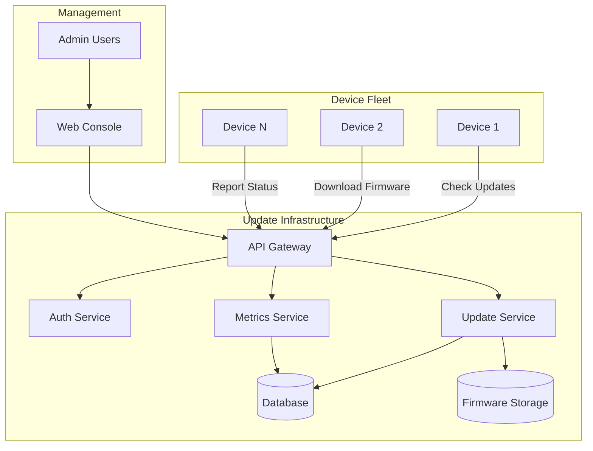
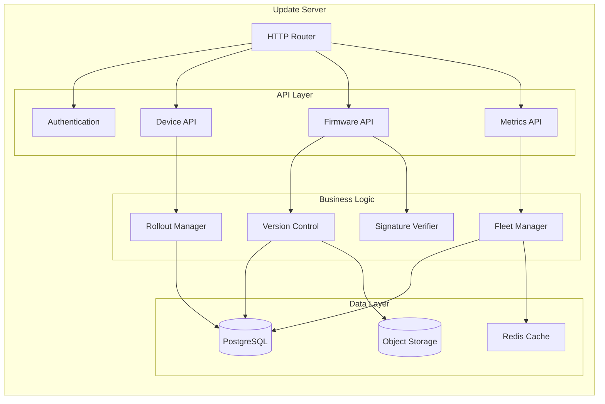
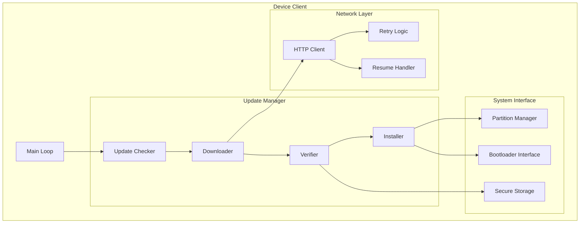
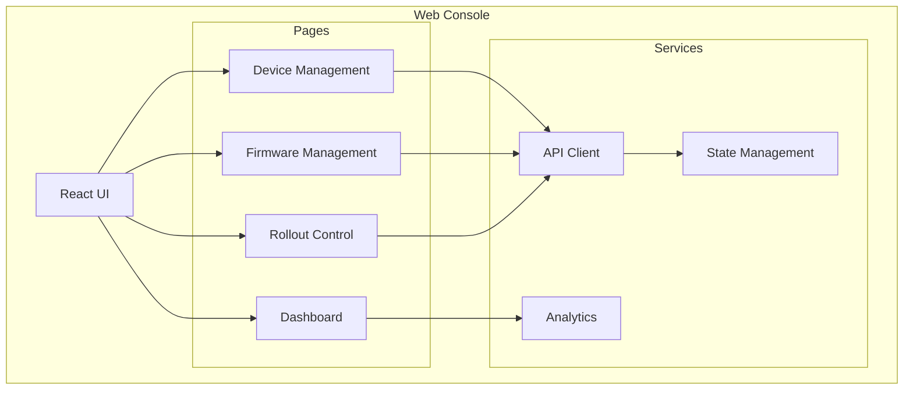
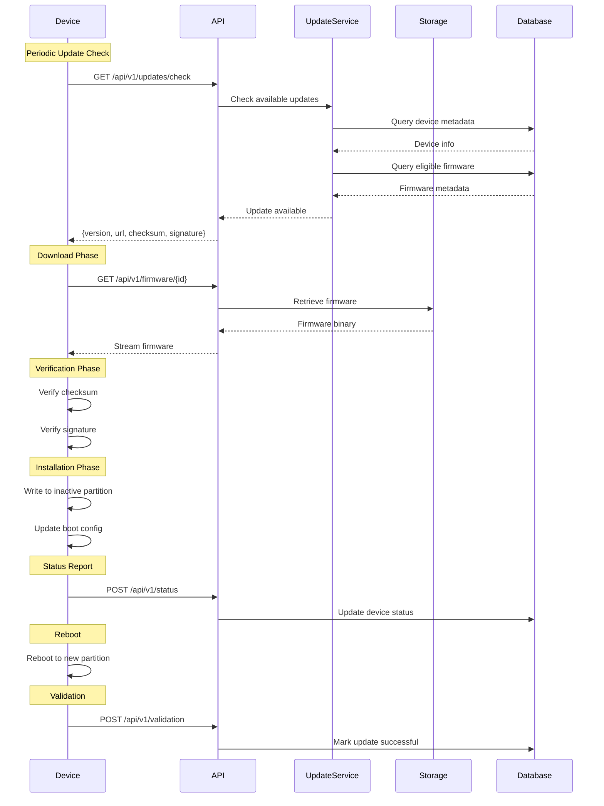
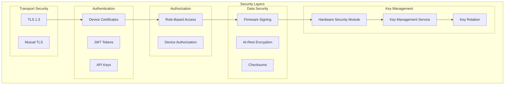
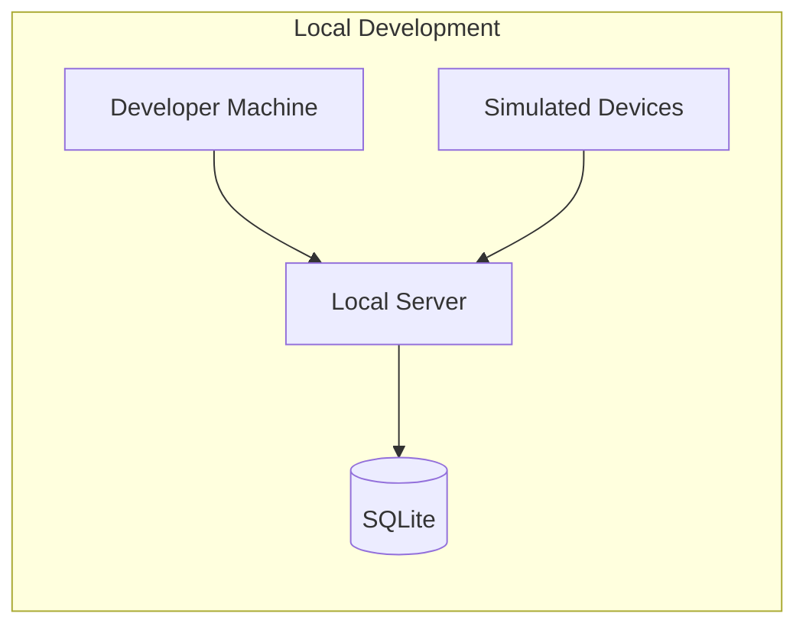
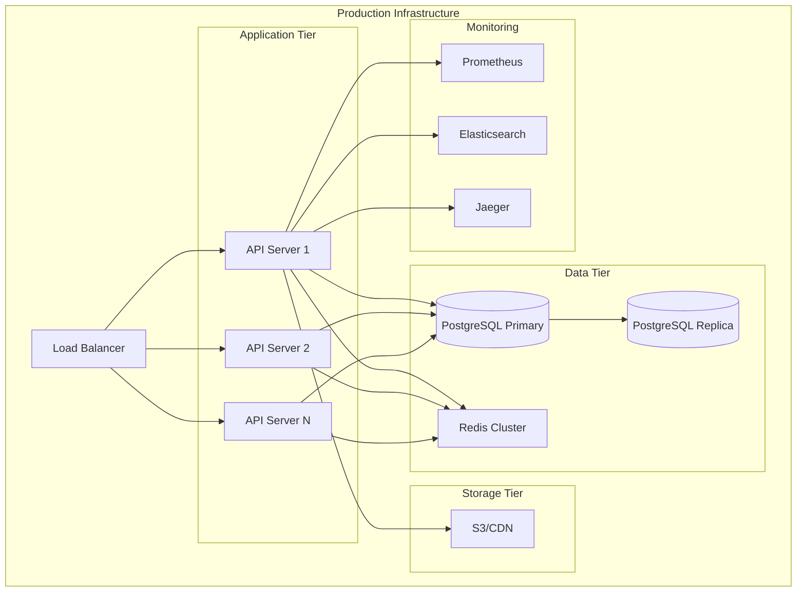

# OTA Demonstrator - Architecture

## System Overview

The OTA Demonstrator follows a client-server architecture with three primary components: the Update Server, Device Clients, and the Management Console. This document provides detailed technical architecture specifications.

## High-Level Architecture



## Component Architecture

### 1. Update Server

The Update Server is the central hub for managing firmware distribution.



#### Server Components

**HTTP Router**
- Request routing and middleware
- Rate limiting
- Request validation
- CORS handling

**Authentication Service**
- JWT token generation/validation
- Device certificate validation
- API key management
- Role-based access control (RBAC)

**Device API**
- Device registration
- Update checking
- Status reporting
- Heartbeat monitoring

**Firmware API**
- Firmware upload/download
- Version management
- Signature generation/validation
- Package metadata

**Rollout Manager**
- Staged rollout orchestration
- Device targeting rules
- Rollout scheduling
- Automatic rollback triggers

**Fleet Manager**
- Device grouping
- Version tracking
- Health monitoring
- Fleet analytics

**Data Storage**
- PostgreSQL: Device metadata, versions, rollout state
- Redis: Session cache, rate limiting, real-time data
- Object Storage (S3/MinIO): Firmware binaries

### 2. Device Client

The Device Client runs on target devices and manages the update process.



#### Client Components

**Update Checker**
- Periodic server polling
- Version comparison
- Update eligibility check
- Metadata parsing

**Downloader**
- Firmware package download
- Progress tracking
- Resume capability
- Bandwidth throttling
- Integrity verification (checksum)

**Verifier**
- Signature validation
- Certificate chain verification
- Version validation
- Prerequisites check

**Installer**
- Partition management
- Firmware installation
- Boot configuration
- Rollback preparation

**System Interface**
- Bootloader communication
- Storage management
- System reboot
- Hardware abstraction

### 3. Management Console

Web-based interface for administrators.



## Update Flow Sequence



## Security Architecture



## Data Models

### Device Model

```
Device {
  id: UUID
  hardware_id: String (unique)
  device_type: String
  current_version: String
  target_version: String (nullable)
  status: Enum [idle, updating, failed, success]
  last_seen: Timestamp
  group_id: UUID
  metadata: JSON
  created_at: Timestamp
  updated_at: Timestamp
}
```

### Firmware Model

```
Firmware {
  id: UUID
  version: String (unique)
  device_type: String
  file_size: Integer
  checksum: String (SHA-256)
  signature: String (RSA/Ed25519)
  storage_path: String
  metadata: JSON {
    release_notes: String
    min_version: String
    dependencies: Array
  }
  created_at: Timestamp
  published_at: Timestamp
}
```

### Rollout Model

```
Rollout {
  id: UUID
  firmware_id: UUID
  name: String
  status: Enum [scheduled, active, paused, completed, cancelled]
  stages: Array [{
    name: String
    percentage: Integer
    start_time: Timestamp
    completion_time: Timestamp
  }]
  target_groups: Array[UUID]
  success_threshold: Float
  rollback_threshold: Float
  created_at: Timestamp
  started_at: Timestamp
  completed_at: Timestamp
}
```

### Update Session Model

```
UpdateSession {
  id: UUID
  device_id: UUID
  firmware_id: UUID
  status: Enum [pending, downloading, installing, validating, success, failed]
  progress: Integer (0-100)
  error_message: String (nullable)
  started_at: Timestamp
  completed_at: Timestamp
  duration: Integer (seconds)
}
```

## API Architecture

### RESTful Endpoints

#### Device Endpoints

```
GET    /api/v1/devices
POST   /api/v1/devices/register
GET    /api/v1/devices/{id}
PUT    /api/v1/devices/{id}
DELETE /api/v1/devices/{id}
GET    /api/v1/devices/{id}/updates
POST   /api/v1/devices/{id}/status
```

#### Firmware Endpoints

```
GET    /api/v1/firmware
POST   /api/v1/firmware
GET    /api/v1/firmware/{id}
GET    /api/v1/firmware/{id}/download
DELETE /api/v1/firmware/{id}
POST   /api/v1/firmware/{id}/publish
```

#### Rollout Endpoints

```
GET    /api/v1/rollouts
POST   /api/v1/rollouts
GET    /api/v1/rollouts/{id}
PUT    /api/v1/rollouts/{id}
POST   /api/v1/rollouts/{id}/start
POST   /api/v1/rollouts/{id}/pause
POST   /api/v1/rollouts/{id}/cancel
GET    /api/v1/rollouts/{id}/metrics
```

### WebSocket Endpoints

```
WS /api/v1/stream/devices/{id}      # Real-time device status
WS /api/v1/stream/rollouts/{id}     # Real-time rollout progress
WS /api/v1/stream/fleet             # Fleet-wide metrics
```

## Deployment Architecture

### Development Environment



### Production Environment



## Technology Stack

### Server

- **Runtime**: Python 3.8+ / Node.js 18+
- **Framework**: FastAPI / Express.js
- **Database**: PostgreSQL 14+
- **Cache**: Redis 7+
- **Storage**: S3-compatible object storage
- **Queue**: RabbitMQ / Redis Queue

### Client

- **Language**: Python / C / Rust
- **HTTP**: requests / libcurl
- **Crypto**: cryptography / OpenSSL
- **Storage**: Platform-specific APIs

### Web Console

- **Framework**: React 18+
- **State**: Redux / Zustand
- **UI**: Material-UI / Tailwind CSS
- **Charts**: Chart.js / Recharts
- **Build**: Vite / Webpack

### DevOps

- **Containers**: Docker
- **Orchestration**: Kubernetes / Docker Compose
- **CI/CD**: GitHub Actions / GitLab CI
- **Monitoring**: Prometheus + Grafana
- **Logging**: ELK Stack / Loki

## Scalability Considerations

### Horizontal Scaling

- **API Servers**: Stateless design allows unlimited horizontal scaling
- **Database**: Read replicas for query scaling
- **Cache**: Redis cluster with consistent hashing
- **Storage**: CDN for firmware distribution

### Performance Optimization

- **Caching Strategy**:
  - Device metadata: 5 minute TTL
  - Firmware metadata: 1 hour TTL
  - Update eligibility: 1 minute TTL

- **Connection Pooling**: Database connection pool (min: 10, max: 100)
- **Rate Limiting**: Per-device: 10 req/min, Per-IP: 100 req/min
- **CDN**: CloudFront/CloudFlare for global firmware distribution

### Database Optimization

- **Indexes**:
  - Device: (hardware_id), (device_type, status), (last_seen)
  - Firmware: (version), (device_type, published_at)
  - UpdateSession: (device_id, started_at), (status)

- **Partitioning**: Time-based partitioning for update_sessions table
- **Archival**: Move completed sessions older than 90 days to archive

## Reliability and Availability

### High Availability

- **API Servers**: Multi-AZ deployment, minimum 3 instances
- **Database**: Primary-replica with automatic failover
- **Cache**: Redis Sentinel for automatic failover
- **Storage**: S3 multi-AZ with versioning

### Disaster Recovery

- **Backup Strategy**:
  - Database: Continuous backup with PITR (Point-In-Time Recovery)
  - Firmware: Cross-region replication
  - Configuration: Version controlled in Git

- **RTO/RPO**:
  - Recovery Time Objective: < 15 minutes
  - Recovery Point Objective: < 5 minutes

### Monitoring and Alerting

- **Health Checks**: /health endpoint on all services
- **Metrics**: CPU, memory, disk, network, application metrics
- **Alerts**: PagerDuty/Opsgenie integration
- **SLOs**: 99.9% uptime, < 500ms p95 latency

## Conclusion

This architecture provides a robust, scalable, and secure foundation for OTA updates. The modular design allows for easy extension and customization based on specific deployment requirements.
