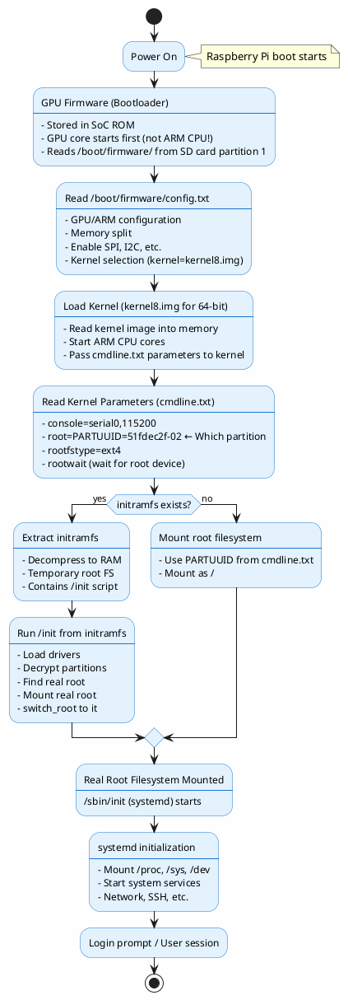
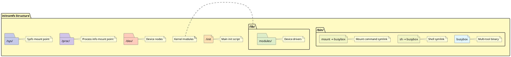
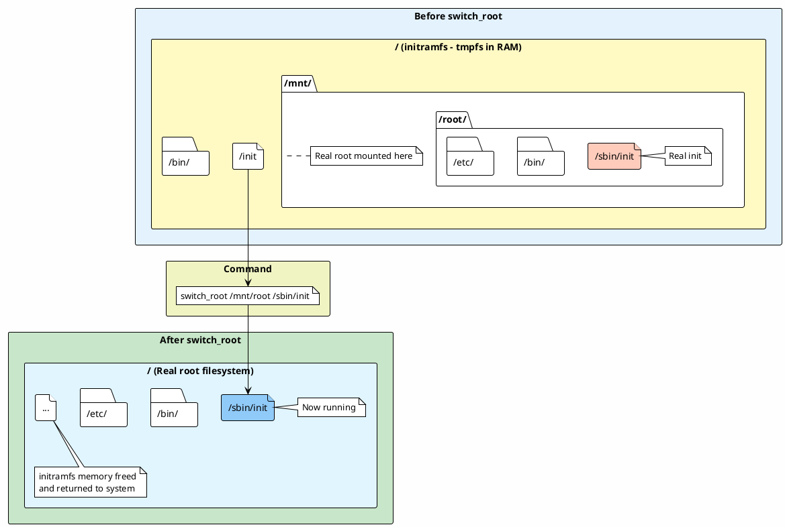
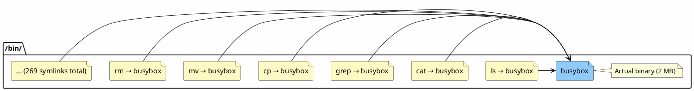
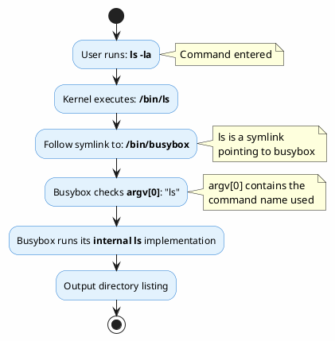
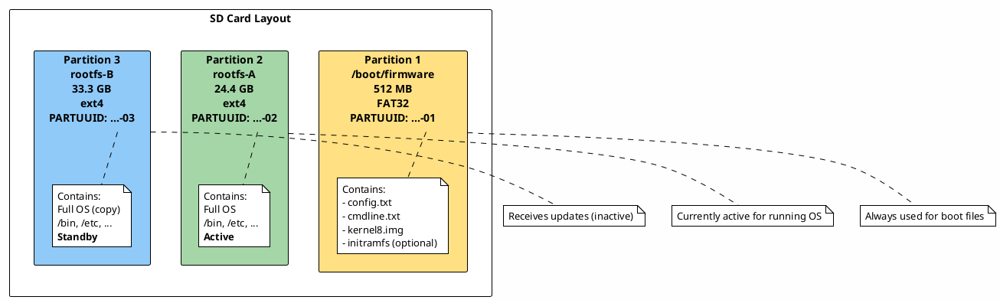

# A/B Partitioning Setup for OTA Updates

This document covers the complete process of setting up A/B partitioning on Raspberry Pi for Over-The-Air (OTA) updates.

---

## Table of Contents

1. [Creating Partitions Using GParted](#1-creating-partitions-using-gparted)
2. [Alternative Methods](#2-alternative-methods)
3. [mDNS (Multicast DNS)](#3-mdns-multicast-dns)
4. [Linux Boot Process with initramfs](#4-linux-boot-process-with-initramfs)
5. [Busybox Explained](#5-busybox-explained)
6. [Partition Switching Flow](#6-partition-switching-flow)

---

## 1. Creating Partitions Using GParted

### On Linux Host (Recommended Method)

**Why use Linux host instead of Raspberry Pi?**
- Safer: You can't modify partitions on a mounted, running system
- Faster: No risk of corrupting the running system
- More reliable: Tools work better when not operating on the active root filesystem

### Step-by-Step Process

#### 1.1 Shutdown Raspberry Pi and Remove SD Card

```bash
# On Raspberry Pi
sudo shutdown -h now

# Remove SD card from Raspberry Pi
# Insert SD card into Linux host computer
```

#### 1.2 Identify the SD Card Device

```bash
# List all block devices
lsblk

# Or use dmesg to see what was just inserted
dmesg | tail -20

# Example output:
# sdb           8:16   1  58.2G  0 disk
# ├─sdb1        8:17   1   512M  0 part
# └─sdb2        8:18   1  57.7G  0 part
```

**IMPORTANT:** Make absolutely sure you have the correct device (e.g., `/dev/sdb`). Using the wrong device will destroy data!

#### 1.3 Launch GParted

```bash
# Install GParted if not already installed
sudo apt install gparted

# Launch GParted with sudo privileges
sudo gparted
```

#### 1.4 Repartitioning Process

1. **Select the SD card device** from the top-right dropdown (e.g., `/dev/sdb`)

2. **Unmount all partitions** if they're mounted:
   - Right-click on each partition → "Unmount"

3. **Shrink the rootfs partition (partition 2)**:
   - Right-click on `/dev/sdb2` → "Resize/Move"
   - Set new size to about 24-25 GB (leave space for partition 3)
   - Click "Resize/Move"

4. **Create new partition 3 (rootfs-B)**:
   - Right-click on unallocated space → "New"
   - File system: `ext4`
   - Label: `rootfs-B`
   - Use remaining space
   - Click "Add"

5. **Apply all operations**:
   - Click the green checkmark (✓) in the toolbar
   - Confirm the operations
   - Wait for completion (may take several minutes)

#### 1.5 Command-Line Alternative Using parted

```bash
# Identify the device
lsblk

# Launch parted
sudo parted /dev/sdb

# Print current partition table
(parted) print

# Resize partition 2 to 24.5GB (assuming it starts at 512MB)
(parted) resizepart 2 25GB

# Create new partition 3 for remaining space
(parted) mkpart primary ext4 25GB 100%

# Set partition name
(parted) name 3 rootfs-B

# Quit parted
(parted) quit

# Format the new partition
sudo mkfs.ext4 -L rootfs-B /dev/sdb3
```

#### 1.6 Copy Rootfs from Partition 2 to Partition 3

```bash
# Create mount points
sudo mkdir -p /mnt/rootfs-a /mnt/rootfs-b

# Mount both partitions
sudo mount /dev/sdb2 /mnt/rootfs-a
sudo mount /dev/sdb3 /mnt/rootfs-b

# Copy the entire filesystem using rsync
# -a: archive mode (preserves permissions, timestamps, symlinks)
# -A: preserve ACLs (Access Control Lists)
# -X: preserve extended attributes
# -v: verbose output
sudo rsync -aAXv /mnt/rootfs-a/ /mnt/rootfs-b/ \
    --exclude=/dev/* \
    --exclude=/proc/* \
    --exclude=/sys/* \
    --exclude=/tmp/* \
    --exclude=/run/* \
    --exclude=/mnt/* \
    --exclude=/media/*

# Create version marker to distinguish partitions
echo "rootfs-B" | sudo tee /mnt/rootfs-b/etc/rootfs-version

# Unmount both partitions
sudo umount /mnt/rootfs-a
sudo umount /mnt/rootfs-b
```

**Why exclude these directories?**
- `/dev`, `/proc`, `/sys`: Virtual filesystems created by kernel at boot
- `/tmp`, `/run`: Temporary runtime data, should start fresh
- `/mnt`, `/media`: Mount points, copying could cause recursion

#### 1.7 Get PARTUUID for Boot Configuration

```bash
# Get PARTUUID of partition 3
sudo blkid /dev/sdb3

# Example output:
# /dev/sdb3: LABEL="rootfs-B" UUID="..." TYPE="ext4" PARTUUID="51fdec2f-03"

# Note down the PARTUUID (e.g., 51fdec2f-03)
```

#### 1.8 Safely Eject and Return SD Card

```bash
# Sync all pending writes
sync

# Eject the SD card
sudo eject /dev/sdb

# Remove SD card from Linux host
# Insert back into Raspberry Pi
```

---

## 2. Alternative Methods

### Method 2.1: Using USB Stick (For Smaller Rootfs)

**Limitations:** Only works if your rootfs is smaller than your USB stick.

```bash
# On Raspberry Pi
# 1. Insert USB stick
lsblk

# 2. Format USB as ext4
sudo mkfs.ext4 -L rootfs-B /dev/sda1

# 3. Mount and copy
sudo mkdir /mnt/usb-rootfs
sudo mount /dev/sda1 /mnt/usb-rootfs
sudo rsync -aAXv / /mnt/usb-rootfs/ \
    --exclude=/dev/* \
    --exclude=/proc/* \
    --exclude=/sys/* \
    --exclude=/tmp/* \
    --exclude=/run/* \
    --exclude=/mnt/*

# 4. Get PARTUUID
sudo blkid /dev/sda1

# 5. Modify /boot/firmware/cmdline.txt
# Change root=PARTUUID=... to the USB's PARTUUID

# 6. Reboot
sudo reboot
```

**Pros:**
- Can be done on running Raspberry Pi
- Easy to test without modifying SD card

**Cons:**
- USB stick must be large enough
- USB performance may be slower
- USB must remain connected
- Not suitable for production OTA systems

### Method 2.2: Using fdisk (Command-Line)

```bash
# On Linux host
sudo fdisk /dev/sdb

# Commands in fdisk:
# p       - print partition table
# d       - delete partition (delete partition 2)
# n       - new partition (create partition 2 with smaller size)
# n       - new partition (create partition 3 with remaining space)
# t       - change partition type to Linux (83)
# w       - write changes and exit

# Format new partitions
sudo mkfs.ext4 -L rootfs-A /dev/sdb2
sudo mkfs.ext4 -L rootfs-B /dev/sdb3
```

**Warning:** fdisk deletes and recreates partitions, so you'll need to restore from backup!

### Method 2.3: Using LVM (Logical Volume Manager)

**Advanced method for dynamic partition sizing:**

```bash
# Convert partition to LVM physical volume
sudo pvcreate /dev/sdb2

# Create volume group
sudo vgcreate ota-vg /dev/sdb2

# Create logical volumes
sudo lvcreate -L 24G -n rootfs-A ota-vg
sudo lvcreate -L 24G -n rootfs-B ota-vg

# Format logical volumes
sudo mkfs.ext4 /dev/ota-vg/rootfs-A
sudo mkfs.ext4 /dev/ota-vg/rootfs-B
```

**Pros:**
- Can resize partitions without repartitioning
- Snapshots available
- More flexible

**Cons:**
- More complex setup
- Requires initramfs with LVM support
- Overhead in bootloader configuration

---

## 3. mDNS (Multicast DNS)

### What is mDNS?

**mDNS (Multicast DNS)** is a protocol that allows hostname resolution without a traditional DNS server.

### How It Works

```
Traditional DNS:
  Computer → DNS Server → IP Address Resolution

mDNS:
  Computer → Multicast Query (224.0.0.251) → All Devices on LAN → Response
```

### mDNS on Raspberry Pi

Raspberry Pi uses **Avahi** daemon for mDNS/Zeroconf support.

```bash
# Check if Avahi is running
systemctl status avahi-daemon

# Avahi configuration
cat /etc/avahi/avahi-daemon.conf

# Check hostname
hostname
# Output: raspberrypi

# This becomes: raspberrypi.local
```

### How SSH Resolution Works

When you run:
```bash
ssh raspberrypi
```

The resolution flow:

1. **SSH client checks `/etc/hosts`**
   ```bash
   cat /etc/hosts
   # Looks for "raspberrypi" entry (usually not there)
   ```

2. **Falls back to DNS lookup via `/etc/nsswitch.conf`**
   ```bash
   cat /etc/nsswitch.conf
   # hosts: files mdns4_minimal [NOTFOUND=return] dns
   ```

   This means:
   - `files`: Check /etc/hosts first
   - `mdns4_minimal`: Try mDNS for `.local` names
   - `dns`: Use traditional DNS server

3. **If "raspberrypi" doesn't have `.local`, some systems auto-append it**
   ```bash
   # SSH might try:
   # 1. raspberrypi
   # 2. raspberrypi.local (via mDNS)
   ```

4. **Avahi responds with IP address**
   ```
   Query: raspberrypi.local → Multicast → Raspberry Pi Avahi daemon responds → 192.168.1.100
   ```

### Useful mDNS Tools

```bash
# Install Avahi utilities
sudo apt install avahi-utils

# Discover all devices on network
avahi-browse -a

# Discover SSH services
avahi-browse -t _ssh._tcp

# Resolve hostname
avahi-resolve -n raspberrypi.local

# Publish service
avahi-publish -s "My Service" _http._tcp 8080
```

### Where mDNS is Useful

1. **Home Networks**: No DNS server needed
2. **IoT Devices**: Automatic discovery (printers, smart devices)
3. **Development**: Easy access to Raspberry Pi without finding IP
4. **Embedded Systems**: Zero-configuration networking
5. **Service Discovery**: Find services on LAN (AirPlay, Chromecast)

### mDNS Limitations

- **Only works on local network** (not across routers)
- **Some corporate networks block multicast traffic**
- **Name conflicts**: Multiple devices with same hostname
- **Security**: No authentication, anyone can respond

---

## 4. Linux Boot Process with initramfs

### Complete Boot Flow



### What is initramfs?

**initramfs** (initial RAM filesystem) is a **temporary root filesystem** loaded into memory during boot.



### Why initramfs is Needed

#### Use Case 1: Root on LVM/RAID/Encrypted

```
Problem: Kernel needs to mount root filesystem
         But root is on encrypted LVM volume
         Kernel doesn't have decryption keys or LVM tools

Solution: initramfs contains:
          1. cryptsetup to decrypt partition
          2. LVM tools to activate volume group
          3. Then mount the real root filesystem
```

**Example Flow:**
```
Kernel → initramfs → cryptsetup unlock → LVM activate → mount root → switch_root
```

#### Use Case 2: Root Filesystem Modules Not Built-In

```
Problem: Root filesystem is on USB drive
         USB drivers are compiled as modules, not built into kernel
         Kernel can't mount root because it can't see USB drive

Solution: initramfs contains USB drivers
          Load drivers → Detect USB → Mount root
```

#### Use Case 3: Network Boot (NFS root)

```
Problem: Root filesystem is on NFS server
         Need network drivers, DHCP, NFS client

Solution: initramfs sets up networking
          1. Load network drivers
          2. Get IP via DHCP
          3. Mount NFS share as root
          4. switch_root to NFS root
```

### initramfs vs initrd (Legacy)

| Feature | initramfs | initrd (legacy) |
|---------|-----------|-----------------|
| Format | CPIO archive | ext2 filesystem image |
| Mount | Extracted to tmpfs | Mounted as loop device |
| Size | Expandable | Fixed size |
| Memory | Reclaimed after switch_root | Wasted until unmount |
| Modern | ✓ Current standard | ✗ Deprecated |

### Raspberry Pi initramfs Location

```bash
# Check if initramfs exists
ls -lh /boot/firmware/initramfs*

# Example output:
# -rw-r--r-- 1 root root 8.1M Jan 15 10:23 /boot/firmware/initramfs8

# Check if kernel is configured to use it
cat /boot/firmware/config.txt | grep initramfs

# Example:
# initramfs initramfs8 followkernel
```

**Note:** Raspberry Pi OS often doesn't use initramfs by default because:
- Root is on simple SD card (no complex setup needed)
- All necessary drivers built into kernel
- Faster boot without initramfs overhead

### When Raspberry Pi WOULD Need initramfs

1. **Boot from USB SSD** (if USB drivers are modules)
2. **Encrypted root filesystem**
3. **Root on NFS share**
4. **Custom A/B boot selection logic**
5. **Root filesystem integrity checks before mount**

### Creating initramfs on Raspberry Pi

```bash
# Install tools
sudo apt install initramfs-tools

# Generate initramfs
sudo update-initramfs -c -k $(uname -r)

# This creates: /boot/initrd.img-$(uname -r)

# Copy to boot partition
sudo cp /boot/initrd.img-$(uname -r) /boot/firmware/initramfs8

# Enable in config.txt
echo "initramfs initramfs8 followkernel" | sudo tee -a /boot/firmware/config.txt

# Reboot to test
sudo reboot
```

### The switch_root Process



---

## 5. Busybox Explained

### What is Busybox?

**Busybox** is a single executable that provides over 300 common Unix utilities in one small binary.

```
Traditional Linux:
  /bin/ls      → 130 KB
  /bin/cat     → 35 KB
  /bin/grep    → 220 KB
  /bin/sed     → 280 KB
  ... (hundreds more)
  Total: ~50-100 MB

Busybox:
  /bin/busybox → 2 MB total
  (contains ls, cat, grep, sed, and 300+ more)
```

### How Busybox Works: The Symlink Trick

```bash
# On Raspberry Pi, check busybox
which busybox
# /usr/bin/busybox

# See what commands busybox provides
busybox --list | wc -l
# 269

# Busybox detects which command was called by its name (argv[0])
```

**Symlink Architecture:**



**Execution Flow:**



### Installing Busybox Symlinks

```bash
# Method 1: Install all symlinks in current directory
cd /bin
sudo busybox --install -s .

# Method 2: Install symlinks in specific directory
sudo busybox --install -s /usr/local/bin

# Verify symlinks
ls -l /bin/ls
# lrwxrwxrwx 1 root root 7 Jan 15 10:00 /bin/ls -> busybox
```

**The `-s` flag creates symlinks instead of hardlinks.**

### Why Use Busybox?

#### 1. **Space Efficiency**

Perfect for embedded systems with limited storage:
```
Full coreutils + util-linux + others: ~100 MB
Busybox with all utilities:            ~2 MB
Savings:                               98% smaller
```

#### 2. **Initramfs**

Initramfs needs to be small and fast to load:
```
initramfs with full tools:    50 MB
initramfs with busybox:       3 MB
Boot time improvement:        2-3 seconds faster
```

#### 3. **Recovery/Rescue Systems**

Single-user mode, rescue shells need minimal dependencies:
```bash
# If /usr partition fails to mount, regular tools won't work
# Busybox in /bin still works because it's self-contained
```

#### 4. **Docker Containers**

Alpine Linux uses busybox for minimal container images:
```
Ubuntu base image:  77 MB
Alpine base image:   5 MB (thanks to busybox)
```

### Busybox Commands

```bash
# File operations
busybox ls, cat, cp, mv, rm, mkdir, touch, chmod, chown

# Text processing
busybox grep, sed, awk, cut, sort, uniq, head, tail

# System
busybox ps, top, kill, df, du, mount, umount, free

# Networking
busybox ping, wget, ifconfig, route, netstat

# Shell
busybox sh, ash (Almquist shell)

# And 250+ more...
```

### Busybox Limitations

1. **Fewer features than GNU versions**
   ```bash
   # GNU ls has --color, --time-style, etc.
   # Busybox ls has basic options only
   ```

2. **Different behavior in edge cases**
   ```bash
   # Some regex patterns differ between GNU grep and busybox grep
   ```

3. **No long options sometimes**
   ```bash
   # GNU: ls --all --human-readable
   # Busybox: ls -ah (short options only)
   ```

### Checking if You're Using Busybox

```bash
# Check which version of a command you're using
ls --version
# If it says "BusyBox v1.x.x", you're using busybox
# If it says "ls (GNU coreutils)", you're using full version

# Or check if it's a symlink
readlink -f $(which ls)
# If points to busybox → using busybox
# Otherwise → using full version
```

### Raspberry Pi and Busybox

Raspberry Pi OS uses **full GNU tools** by default, not busybox:

```bash
# Check
ls --version
# ls (GNU coreutils) 8.32

# But busybox is still installed for compatibility
which busybox
# /usr/bin/busybox

# Useful for scripting or initramfs
```

---

## 6. Partition Switching Flow

### Overview

A/B partition switching allows safe OTA updates by maintaining two separate root filesystems.

### Partition Layout



### Switching Mechanism

#### Step 1: Check Current Boot Partition

```bash
# Method 1: Check cmdline.txt
cat /boot/firmware/cmdline.txt
# Look for: root=PARTUUID=51fdec2f-02  ← Currently booting from partition 2

# Method 2: Check what's mounted as /
findmnt /
# TARGET SOURCE         FSTYPE OPTIONS
# /      /dev/mmcblk0p2 ext4   rw,relatime

# Method 3: Check version marker
cat /etc/rootfs-version
# rootfs-A  or  rootfs-B
```

#### Step 2: Prepare Alternate Partition

Before switching, the inactive partition should have updated software:

```bash
# If currently on partition 2 (rootfs-A), update partition 3 (rootfs-B)
sudo mkdir -p /mnt/rootfs-b
sudo mount /dev/mmcblk0p3 /mnt/rootfs-b

# Apply OTA update to /mnt/rootfs-b/
# (This would be done by SWUpdate or custom update mechanism)

# Verify update integrity
# Check version markers, checksums, etc.

sudo umount /mnt/rootfs-b
```

#### Step 3: Switch Boot Configuration

```bash
# Get PARTUUID of target partition
sudo blkid /dev/mmcblk0p3
# /dev/mmcblk0p3: PARTUUID="51fdec2f-03"

# Backup current cmdline.txt
sudo cp /boot/firmware/cmdline.txt /boot/firmware/cmdline.txt.backup

# Method 1: Manual edit
sudo nano /boot/firmware/cmdline.txt
# Change: root=PARTUUID=51fdec2f-02
# To:     root=PARTUUID=51fdec2f-03

# Method 2: Automated with sed
sudo sed -i 's/PARTUUID=51fdec2f-02/PARTUUID=51fdec2f-03/' /boot/firmware/cmdline.txt

# Verify change
cat /boot/firmware/cmdline.txt | grep root=
```

#### Step 4: Reboot

```bash
# Sync all pending writes
sync

# Reboot
sudo reboot
```

#### Step 5: Verify New Boot

```bash
# After reboot, verify we're on partition 3
findmnt /
# /      /dev/mmcblk0p3 ext4   rw,relatime

# Check version
cat /etc/rootfs-version
# rootfs-B

# Check cmdline
cat /proc/cmdline | grep root=
# ... root=PARTUUID=51fdec2f-03 ...
```

### Rollback Mechanism

If the new partition fails to boot or has issues:

```bash
# Boot into the old partition
# Either:
# 1. Physically access Raspberry Pi, edit cmdline.txt on boot partition
# 2. Use watchdog timer to auto-revert

# Example watchdog approach:
# 1. Before switching, set watchdog timeout
# 2. After boot, user confirms system is healthy
# 3. If no confirmation within timeout, watchdog reboots
# 4. Bootloader counts failed boots, reverts to old partition after 3 failures
```

### Safety Mechanisms

1. **Keep old partition intact**
   - Don't delete or modify partition A when booting from partition B
   - Always maintain a working fallback

2. **Atomic updates**
   - Update entire partition, then switch
   - Never update the currently running partition

3. **Version markers**
   ```bash
   # In each rootfs
   echo "v1.0.0" | sudo tee /etc/rootfs-version
   ```

4. **Boot counters**
   ```bash
   # Track failed boots
   # If boot_count > 3, revert to old partition
   ```

---

## Complete A/B Update Flow Diagram

```plantuml
@startuml
!theme plain
skinparam backgroundColor #FEFEFE
skinparam state {
  BackgroundColor #E3F2FD
  BorderColor #1976D2
  FontSize 12
}

title A/B PARTITION UPDATE FLOW

state "INITIAL STATE" as S0 {
  state "Partition 1\nBOOT\ncmdline.txt\nroot=...02" as S0_P1 #FFE082
  state "Partition 2\nrootfs-A\nv1.0.0\nACTIVE ✓\nRUNNING" as S0_P2 #A5D6A7
  state "Partition 3\nrootfs-B\nv1.0.0\nINACTIVE\nSTANDBY" as S0_P3 #90CAF9

  S0_P1 --> S0_P2: points to
}

state "RECEIVE OTA UPDATE" as S1 {
  state "OTA Package\nv2.0.0" as pkg #FFCCBC
  state "Download to /tmp/\nVerify Signature" as download #FFF9C4
  pkg --> download
}

state "APPLY UPDATE TO INACTIVE PARTITION" as S2 {
  state "Partition 1\nBOOT\ncmdline.txt\nroot=...02" as S2_P1 #FFE082
  state "Partition 2\nrootfs-A\nv1.0.0\nACTIVE ✓\nRUNNING" as S2_P2 #A5D6A7
  state "Partition 3\nrootfs-B\nv1.0.0\nUPDATING..." as S2_P3 #FFE0B2

  state "Mount p3\nApply files\nVerify\nUnmount" as apply #F0F4C3

  S2_P1 --> S2_P2: points to
  apply --> S2_P3
}

state "UPDATE APPLIED" as S3 {
  state "Partition 1\nBOOT\ncmdline.txt\nroot=...02" as S3_P1 #FFE082
  state "Partition 2\nrootfs-A\nv1.0.0\nACTIVE ✓\nRUNNING" as S3_P2 #A5D6A7
  state "Partition 3\nrootfs-B\nv2.0.0 ✓\nREADY\nVERIFIED" as S3_P3 #81C784

  S3_P1 --> S3_P2: points to
}

state "SWITCH BOOT CONFIG" as S4 {
  state "Partition 1\nBOOT\nMODIFIED\ncmdline.txt\nroot=...03" as S4_P1 #FFD54F
  state "Partition 2\nrootfs-A\nv1.0.0\nWILL BE\nINACTIVE" as S4_P2 #E0E0E0
  state "Partition 3\nrootfs-B\nv2.0.0\nWILL BOOT\nNEXT" as S4_P3 #4FC3F7

  state "sed -i 's/02/03/'\ncmdline.txt" as switch #FFAB91

  S4_P1 --> S4_P3: points to
  switch --> S4_P1
}

state "REBOOT SYSTEM" as S5 {
  state "GPU Firmware\nreads /boot" as gpu #B39DDB
  state "Load kernel\nRead cmdline.txt\nroot=PARTUUID=...03" as kernel #9FA8DA
  state "Mount partition 3\nas root filesystem" as mount #90CAF9

  gpu --> kernel
  kernel --> mount
}

state "RUNNING NEW VERSION" as S6 {
  state "Partition 1\nBOOT\ncmdline.txt\nroot=...03" as S6_P1 #FFE082
  state "Partition 2\nrootfs-A\nv1.0.0\nINACTIVE\nSTANDBY" as S6_P2 #E0E0E0
  state "Partition 3\nrootfs-B\nv2.0.0\nACTIVE ✓\nRUNNING" as S6_P3 #A5D6A7

  state "Test new version\nVerify apps" as test #FFF9C4

  S6_P1 --> S6_P3: points to
  S6_P3 --> test
}

state "DECISION" as decision <<choice>>

state "SUCCESS" as success {
  state "Keep v2.0.0\nDone ✓" as keep #81C784
}

state "ROLLBACK" as rollback {
  state "Partition 1\nBOOT\nROLLBACK\ncmdline.txt\nroot=...02" as R_P1 #FFE082
  state "Partition 2\nrootfs-A\nv1.0.0\nWILL BOOT\n(GOOD)" as R_P2 #A5D6A7
  state "Partition 3\nrootfs-B\nv2.0.0\nFAILED ✗\nABANDONED" as R_P3 #EF5350

  state "sed -i 's/03/02/'\ncmdline.txt\nreboot" as rollback_cmd #FFAB91

  rollback_cmd --> R_P1
  R_P1 --> R_P2: points to
}

state "FINAL STATE AFTER ROLLBACK" as final {
  state "Partition 1\nBOOT\ncmdline.txt\nroot=...02" as F_P1 #FFE082
  state "Partition 2\nrootfs-A\nv1.0.0\nACTIVE ✓\nRUNNING\n(SAFE)" as F_P2 #A5D6A7
  state "Partition 3\nrootfs-B\nv2.0.0\nINACTIVE\n(Retry or Discard)" as F_P3 #E0E0E0

  F_P1 --> F_P2: points to
}

[*] --> S0
S0 --> S1: OTA available
S1 --> S2: Download complete
S2 --> S3: Update extracted
S3 --> S4: Ready to switch
S4 --> S5: Reboot
S5 --> S6: Boot complete
S6 --> decision: Verify
decision --> success: OK
decision --> rollback: FAILED
rollback --> final: Reverted

@enduml
```



---

## Key Takeaways

1. **Always modify inactive partition**, never the running system
2. **Boot partition (p1) is shared** - contains boot config for both A and B
3. **cmdline.txt controls which partition boots** via PARTUUID parameter
4. **Bootloader (GPU firmware) remains unchanged** - it just passes parameters to kernel
5. **Kernel mounts the root partition** specified in cmdline.txt
6. **Always maintain a working fallback** - don't delete old version until new one is verified
7. **Use version markers** to track which partition has which version
8. **Implement watchdog or boot counters** for automatic rollback on failure

---

## Next Steps

1. Test partition switching manually
2. Implement automatic version detection
3. Add watchdog timer for automatic rollback
4. Create OTA update script that:
   - Downloads package
   - Verifies signature
   - Applies to inactive partition
   - Switches boot config
   - Reboots
5. Test complete OTA flow end-to-end
6. Implement SWUpdate integration

---

## References

- [Raspberry Pi Boot Documentation](https://www.raspberrypi.com/documentation/computers/raspberry-pi.html#raspberry-pi-boot-modes)
- [initramfs Documentation](https://www.kernel.org/doc/html/latest/admin-guide/initrd.html)
- [Busybox Documentation](https://busybox.net/about.html)
- [A/B System Updates](https://source.android.com/devices/tech/ota/ab)
- [SWUpdate Documentation](https://sbabic.github.io/swupdate/)
